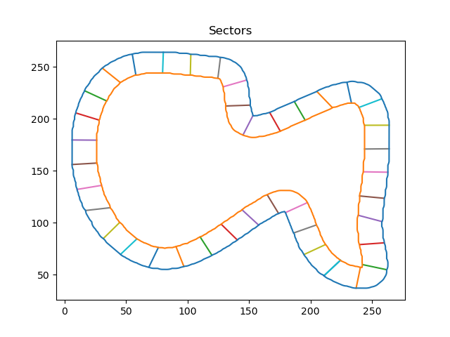
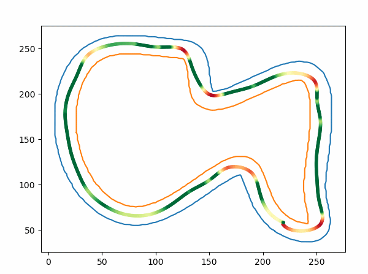
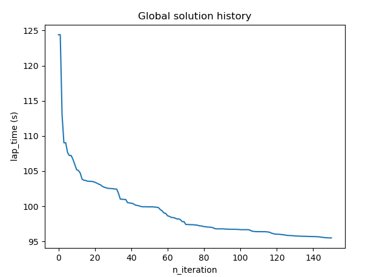

<h1 align="center">Racing Line Optimization with PSO</h1>

**This repository is a fork of https://github.com/ParsaD23/Racing-Line-Optimization-with-PSO**

# Éclipse Fork of Racing Line Optimization with PSO

## Why the Fork?

Needed something to generate a speed map. This works very well with a few modifications to fit in the rest of our pipeline :)

## How to use with PyStrategy?

>The project uses a Micromamba virtual environment

1. Generate KML track using Google Earth
2. Convert KML to Plain Text with [GPS Visualizer](https://www.gpsvisualizer.com/convert_input?form:add_elevation=auto&convert_add_course=1&convert_add_distance=1&convert_add_slope=1&convert_add_speed=1&units=metric)
3. Edit values in `csv_to_json.py` to have the propper UTM zone as well a good file paths.
4. Run csv_to_json.py
5. Put the output of that script as the new tacks.json
6. Edit values in `main.py` for seciton count and stuff
6. Run `python pso/main.py`
7. Put the contents of `speed_points.csv` in [GPS Visualizer](https://www.gpsvisualizer.com/convert_input?form:add_elevation=auto&convert_add_course=1&convert_add_distance=1&convert_add_slope=1&convert_add_speed=1&units=metric)
8. Put the exported file in PyStrategy as needed
9. Link to convert back to KML for use in [Google Earth](https://www.gpsvisualizer.com/map_input?add_elevation=auto&convert_routes=t_aw&force_type=t&form=googleearth&googleearth_zip=0&tickmark_zero=1&trk_colorize=speed&units=metric)


# Original README

This repository contains a racing line optimization algorithm in python that uses **Particle Swarm Optimization**.

## Requirements

This version was developed and tested with ```python==3.8.12```. The following modules are required:
* ```matplotlib```
* ```numpy```
* ```scipy```
* ```shapely```

## How does it work?

### 1. Input Parameters

The **input** parameters are:
- `track_layout`: array of $(x,y)$ coordinates that represent the layout of the track.
- `width`: width of the track. We assume it is constant along the track.
They are stored in the `./data/tracks.json` file.

### 2. Define the search space

The **track borders** are obtained by adding an offset (i.e. half of the `width`) to the `track_layout` in both directions (left and right).

Now, we define the **search space** of the algorithm, namely the sectors. Sectors are equally distanced segments that go from the outer border to inner border of the track. The points through which the racing line passes, will move along these segments:



### 3. Compute racing line

To find the racing line, the algorithm will fit a cubic spline to the sector points. The vehicles's speed at each point $i$ of the racing line is computed as:

$$ v_i = \sqrt{\mu * r_i * 9.81} $$

where $\mu$ is the coeffcient of friction (set to $0.13$) and $r$ is the radius of curvature which is computed as:

$$ r = \frac{1}{k} \quad \text{with} \quad k = \frac{|x'y''-y'x''|}{(x'^2+y'^2)^{3/2}} $$

where $x$ and $y$ are the coordinates of each point of the spline.

The algorithm's **objective** is to compute the fastest racing line around the track based on the laptime. Having the speed and the distance between each pair of points computed by the spline, we can compute the laptime.

## Run the algorithm

Run the `main.py` script to see the optimizer work. Inside the main function you will have the possibility to change the hyper-parameters of the PSO algorithm.





## License

This project is under the MIT license. See [LICENSE](https://github.com/ParsaD23/Racing-Line-Optimization-with-PSO/blob/master/LICENSE) for more information.
